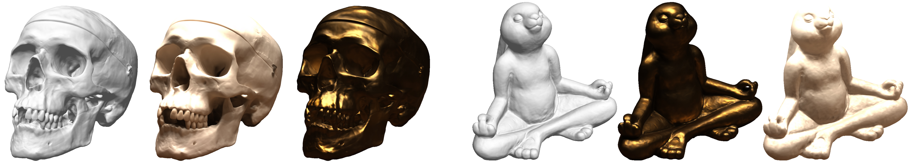

# HashModFFBanks-IDR NSR(Neural Surface Reconstruction)
This repository is based on MV-NSR(Multi-View Neural Surface Reconstruction) and focuses on neural encoding High Frequency 3D content for fast SDF convergence. This work is also applied in the NeuS project and is part of my diploma thesis. 

## HASH ENCODING  
This repository applies spatial input encoding with multi resolution spatial embeddings as proposed in instant-ngp [Paper](https://nvlabs.github.io/instant-ngp/assets/mueller2022instant.pdf) 

## Neural Fourier Filter Banks
Apart from spatial encoding a frequency decomposition of the input is made coherently with the multi-resolution hash enmbedding. This is done to capture the High Frequency input content of the Input images and the surface state and render it eventually to the finished recostructed surface. The method adopts the wavelet decomposition concept as proposed in the Neural Fourier Filter Banks [Paper](https://arxiv.org/abs/2212.01735)


## Style Modulated Embeddings

The higher level of the SDF input optimization for better convergence is made through modulating and demodulating the Filter Banks Space/Frequency decomposition and giving attention to the most valuable 3D embeddings that let SDF converge faster.


 
The NSR base models are based on IDR with some modifications to stable capture the 3D High Frequency Content. <br><br> IDR is presented bellow. 

## Project Outline 

<!-- <p align="center">
  
</p> -->

This repository contains an implementation for the NeurIPS 2020 paper <a href="https://arxiv.org/abs/2003.09852">Multiview Neural Surface Reconstruction by Disentangling Geometry and Appearance</a>.

The paper introduce Implicit Differentiable Renderer (IDR): a neural network architecture that simultaneously learns the 3D geometry, appearance and cameras from a set of 2D images.
IDR able to produce high fidelity 3D surface reconstruction, by disentangling geometry and appearance, learned solely from masked 2D images and rough camera estimates.


## Installation Requirments

The code is compatible with python 3.9 and pytorch 2.1. In addition, the following packages are required:  
numpy, pyhocon, plotly, scikit-image, trimesh, imageio, opencv, torchvision.
You can create an anaconda environment called `hashmodnsr` with the required dependencies by running:
```
conda env create -f environment.yml
conda activate hashmodnsr
```

## Usage
### Multiview 3D reconstruction
#### Data
We apply our multiview surface reconstruction model to real 2D images from the <a href="http://roboimagedata.compute.dtu.dk/?page_id=36" target="_blank">DTU MVS repository</a>. 
The 15 scans data, including the manually annotated masks and the noisy initializations for the trainable cameras setup, can be download using:
```
bash data/download_data.sh 
```
For more information on the data convention and how to run IDR on a new data please have a look at <a href="https://github.com/lioryariv/idr/blob/main/DATA_CONVENTION.md">data convention</a>.<br><br>


Made different configuration files for each input embedding model selected
### Training with different Embedding model
```
cd ./code 
python training/exp_runner.py --conf ./confs/embedder_conf_var/{Embedding_Model}/{camera_config} --scan_id SCAN_ID 
```
where Embedding_Model directory can be one of the following set:
```
{Embedding_Model}: {'FFB','FFB_TCNN','FourierFeatures','HashGridTcnn','MultiResHash'}

```

Regarding {camera_config} in this project is used IDR method to generate 3D reconstructions in two different subsetups for each embedding model setup:
#### Training with fixed ground truth cameras
For training IDR run:
```
cd ./code
python training/exp_runner.py --conf ./confs/embedder_conf_var/{Embedding_Model}/dtu_fixed_cameras.conf --scan_id SCAN_ID
```
where SCAN_ID is the id of the DTU scene to reconstruct.

Then, to produce the meshed surface, run:
```
cd ./code
python evaluation/eval.py  --conf ./confs/embedder_conf_var/{Embedding_Model}/dtu_fixed_cameras.conf --scan_id SCAN_ID --checkpoint CHECKPOINT [--eval_rendering]
```
where CHECKPOINT is the epoch you wish to evaluate or 'latest' if you wish to take the most recent epoch.
Turning on `--eval_rendering` will further produce and evaluate PSNR of train image reconstructions.


#### Training with trainable cameras with noisy initializations
For training IDR with cameras optimization run:
```
cd ./code
python training/exp_runner.py --train_cameras --conf ./confs/embedder_conf_var/{Embedding_Model}/dtu_trained_cameras.conf --scan_id SCAN_ID
```

Then, to evaluate cameras accuracy and to produce the meshed surface, run:
```
cd ./code
python evaluation/eval.py  --eval_cameras --conf ./confs/embedder_conf_var/{Embedding_Model}/dtu_trained_cameras.conf --scan_id SCAN_ID --checkpoint CHECKPOINT [--eval_rendering]
```


#### Evaluation on pretrained models

We have uploaded IDR trained models, and you can run the evaluation using:
```
cd ./code
python evaluation/eval.py --exps_folder trained_models --conf ./confs/embedder_conf_var/{Embedding_Model}/dtu_fixed_cameras.conf --scan_id SCAN_ID  --checkpoint 2000 [--eval_rendering]
```
Or, for trained cameras:
```
python evaluation/eval.py --exps_folder trained_models --conf ./confs/embedder_conf_var/{Embedding_Model}/dtu_trained_cameras.conf --scan_id SCAN_ID --checkpoint 2000 --eval_cameras [--eval_rendering]
```


### Disentanglement of geometry and appearance

<p align="center">
  
</p>


For transferring the appearance learned from one scene to unseen geometry, run:

```
cd ./code
python evaluation/eval_disentanglement.py --geometry_id GEOMETRY_ID --appearance_id APPEARANCE _ID
```

This script will produce novel views of the geometry of the `GEOMETRY_ID` scan trained model, and the rendering of the `APPEARANCE_ID` scan trained model.

	
	
## Related papers
Here are related works on implicit neural representation from our group:
* [Gropp et al. - Implicit Geometric Regularization for Learning Shapes (2020)](https://arxiv.org/abs/2002.10099)
* [Atzmon & Lipman. - SAL++: Sign Agnostic Learning with Derivatives (2020)](https://arxiv.org/abs/2006.05400)
* [Atzmon & Lipman. - SAL: Sign Agnostic Learning of Shapes From Raw Data (2020)](https://arxiv.org/abs/1911.10414)
* [Atzmon et al. - Controlling Neural Level Sets (2019)](https://arxiv.org/abs/1905.11911)


## References
```
@article{yariv2020multiview,
	title={Multiview Neural Surface Reconstruction by Disentangling Geometry and Appearance},
	author={Yariv, Lior and Kasten, Yoni and Moran, Dror and Galun, Meirav and Atzmon, Matan and Ronen, Basri and Lipman, Yaron},
	journal={Advances in Neural Information Processing Systems},
	volume={33},
	year={2020}
	}
```

```
@misc{wu2022neural,
      title={Neural Fourier Filter Bank}, 
      author={Zhijie Wu and Yuhe Jin and Kwang Moo Yi},
      year={2022},
      eprint={2212.01735},
      archivePrefix={arXiv}
}
```
