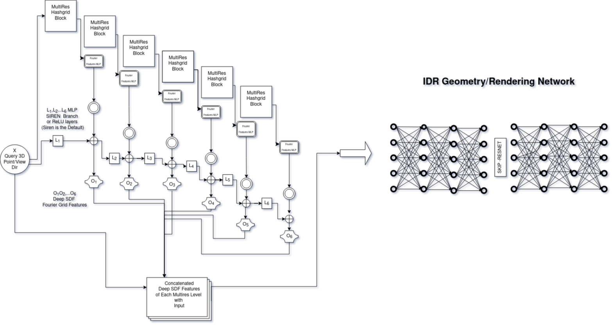
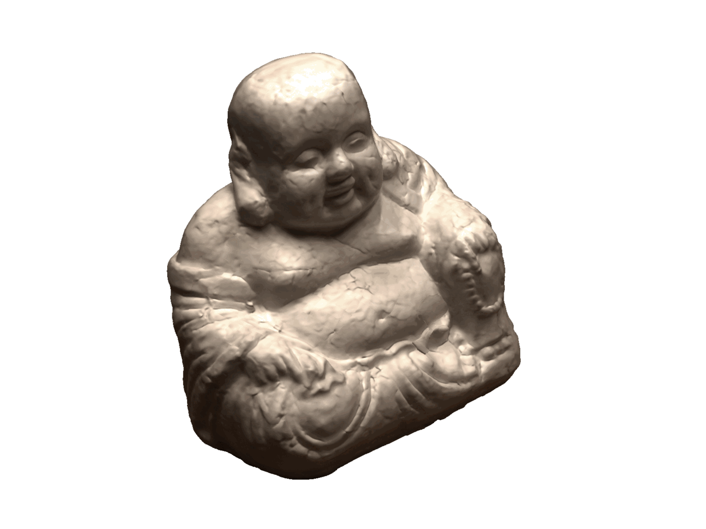

# HashModFFBanks-IDR NSR(Neural Surface Reconstruction)
This repository is based on MV-NSR(Multi-View Neural Surface Reconstruction) and focuses on neural encoding High Frequency 3D content for fast SDF convergence. This work is also applied in the NeuS project and is part of my diploma thesis. 

<p align="center">
    
</p>

## HASH ENCODING  
This repository applies spatial input encoding with multi resolution spatial embeddings as proposed in instant-ngp [Paper](https://nvlabs.github.io/instant-ngp/assets/mueller2022instant.pdf) 

## Neural Fourier Filter Banks
Apart from spatial encoding a frequency decomposition of the input is made coherently with the multi-resolution hash enmbedding. This is done to capture the High Frequency input content of the supervision images by embedding 3D input differential points to high frequency maps and make the SDF approximate faster the intersection points (of the surface) w.r.t the high frequency content of the surface arround the area. The method adopts the wavelet decomposition concept as proposed in the Neural Fourier Filter Banks [Paper](https://arxiv.org/abs/2212.01735)


## Style Modulated Embeddings

The higher level of the SDF input optimization for better convergence is made through modulating and demodulating the Filter Banks Space/Frequency decomposition and giving attention to the most valuable 3D embeddings that let SDF converge faster.


 
The NSR base models are based on IDR with some modifications to stable capture the 3D High Frequency Content. <br><br> IDR is presented bellow. 

## IDR - Project Outline 
Note: Most of the code of IDR is borrowed from IDR original [repository](https://github.com/lioryariv/idr) with minor modifications so the focus on the project is directed to the input encoding Networks and the 
convergence optimization of IDR. Bellow are some original IDR notes modified to apply to the current project.

<!-- <p align="center">
  
</p> -->

This repository contains an implementation for the NeurIPS 2020 paper <a href="https://arxiv.org/abs/2003.09852">Multiview Neural Surface Reconstruction by Disentangling Geometry and Appearance</a>.

The paper introduce Implicit Differentiable Renderer (IDR): a neural network architecture that simultaneously learns the 3D geometry, appearance and cameras from a set of 2D images.
IDR able to produce high fidelity 3D surface reconstruction, by disentangling geometry and appearance, learned solely from masked 2D images and rough camera estimates.


## Installation Requirments

The code is compatible with python 3.9 and pytorch 2.1. In addition, the following packages are required:  

```
numpy, pyhocon, plotly, scikit-image, trimesh, imageio, opencv, torchvision.
[contained in requirements.txt with the used versions]
```

In case you want to use an anaconda environment you can create one called `hashmodnsr` with the required *(some maybe outdated)* dependencies by running:
```
conda env create -f environment.yml (be sure to fix image io problems -> restoring depracted code from original IDR repo)
conda activate hashmodnsr
```
Last but **not least**. The project is using some models that are supported by *opensource* libraries not in the standard PyPl repository which are:
<br><br>
* Nvidia's Tiny-Cuda-NN - used on FullyFusedMLP counterparts of the original pytorch Embedding Networks (You can use the original networks by not removing the comments on [Custom_Embedding_Network.py](https://github.com/ArtoriasAbyssslayer/HashModNFFBanks-IDR/blob/master/code/model/custom_embedder_decoder.py) selector )
* Facebook's Pytorch 3d - used to calculate Champher Distance for Mesh Evaluations
<br><br>
You can install those libraries with the commands given bellow 
```
TinyCUDAnn
$ pip install git+https://github.com/NVlabs/tiny-cuda-nn/#subdirectory=bindings/torch

Pytorch3D
$ pip install "git+https://github.com/facebookresearch/pytorch3d.git"
```
## Usage
### Multiview 3D reconstruction
#### Data
Multiview surface reconstruction model is applied to real 2D images from the <a href="http://roboimagedata.compute.dtu.dk/?page_id=36" target="_blank">DTU MVS repository</a>. 
The 15 scans data, including the manually annotated masks and the noisy initializations for the trainable cameras setup, can be download using:
```
bash data/download_data.sh 
```
For more information on the data convention and how to run IDR on a new data please have a look at <a href="https://github.com/lioryariv/idr/blob/main/DATA_CONVENTION.md">data convention</a>.<br><br>


Different configuration files are made for each input embedding model selected
### Training with different Embedding model
```
cd ./code 
python training/exp_runner.py --conf ./confs/embedder_conf_var/{Embedding_Model}/{camera_config} --scan_id SCAN_ID 
```
where Embedding_Model directory can be one of the following set:
```
{Embedding_Model}: {'FFB','FFB_TCNN','FourierFeatures','HashGridTcnn','MultiResHash'}

```

Regarding {camera_config} in this project is used IDR method to generate 3D reconstructions in two different subsetups for each embedding model setup:
#### Training with fixed ground truth cameras
For training IDR run:
```
cd ./code
python training/exp_runner.py --conf ./confs/embedder_conf_var/{Embedding_Model}/dtu_fixed_cameras.conf --scan_id SCAN_ID
```
where SCAN_ID is the id of the DTU scene to reconstruct.

Then, to produce the meshed surface, run:
```
cd ./code
python evaluation/eval.py  --conf ./confs/embedder_conf_var/{Embedding_Model}/dtu_fixed_cameras.conf --scan_id SCAN_ID --checkpoint CHECKPOINT [--eval_rendering]
```
where CHECKPOINT is the epoch you wish to evaluate or 'latest' if you wish to take the most recent epoch.
Turning on `--eval_rendering` will further produce and evaluate PSNR of train image reconstructions.


#### Training with trainable cameras with noisy initializations
For training IDR with cameras optimization run:
```
cd ./code
python training/exp_runner.py --train_cameras --conf ./confs/embedder_conf_var/{Embedding_Model}/dtu_trained_cameras.conf --scan_id SCAN_ID
```

Then, to evaluate cameras accuracy and to produce the meshed surface, run:
```
cd ./code
python evaluation/eval.py  --eval_cameras --conf ./confs/embedder_conf_var/{Embedding_Model}/dtu_trained_cameras.conf --scan_id SCAN_ID --checkpoint CHECKPOINT [--eval_rendering]
```


#### Evaluation on pretrained models

We have uploaded IDR trained models, and you can run the evaluation using:
```
cd ./code
python evaluation/eval.py --exps_folder trained_models --conf ./confs/embedder_conf_var/{Embedding_Model}/dtu_fixed_cameras.conf --scan_id SCAN_ID  --checkpoint 2000 [--eval_rendering]
```
Or, for trained cameras:
```
python evaluation/eval.py --exps_folder trained_models --conf ./confs/embedder_conf_var/{Embedding_Model}/dtu_trained_cameras.conf --scan_id SCAN_ID --checkpoint 2000 --eval_cameras [--eval_rendering]
```  
#### Make it simple -- Avoid Headackes 


For simpler usage of the code under /code/scripts directory exist scirpts that run with arguments to execute every training with every embedding network and every scan in a failproof manner(meaning handling crashes due to OOM or other issues that may or maynot occure depending on the system specifications)


```
cd code/scripts
./run_training_failsafe.sh --exp NFFB --scan_id 65 [--is_continue]
```

**An equivalent script hase been made for evaluation of a model**
### Spatial Coordinate Hash Grid Encoding
<p align="center">
 
</p>
<p align="center">
    
 
</p>

### Spatial,Frequency Decomposition NFFB3D (Neural Fourier FIlter Banks)
<p align="center">
 
</p>
<p align="center">
      
 
</p>

### StyleModulated Neural Fourier Filter Banks 
* style attention on Fourier-Grid Features
<p align="center">
    
    
    
    
</p>

### StyleModulated Neural Fourier Filter Banks using TinyCUDANN HashGrid
<p align="center">
    
    
    
</p>

### Disentanglement of geometry and appearance

using Stylemod NFFB
<p align="center">
  
</p>

For transferring the appearance learned from one scene to unseen geometry, run:

```
cd ./code
python evaluation/eval_disentanglement.py --geometry_id GEOMETRY_ID --appearance_id APPEARANCE _ID
```

This script will produce novel views of the geometry of the `GEOMETRY_ID` scan trained model, and the rendering of the `APPEARANCE_ID` scan trained model.


**TinyCudaNN HashGrid Implementation seems to work faster with lower memory usage and optimized for RTX card and get better appearence results but same geometry**

## References
```
@article{yariv2020multiview,
	title={Multiview Neural Surface Reconstruction by Disentangling Geometry and Appearance},
	author={Yariv, Lior and Kasten, Yoni and Moran, Dror and Galun, Meirav and Atzmon, Matan and Ronen, Basri and Lipman, Yaron},
	journal={Advances in Neural Information Processing Systems},
	volume={33},
	year={2020}
	}
```
```
@article{mueller2022instant,
    author = {Thomas M\"uller and Alex Evans and Christoph Schied and Alexander Keller},
    title = {Instant Neural Graphics Primitives with a Multiresolution Hash Encoding},
    journal = {ACM Trans. Graph.},
    issue_date = {July 2022},
    volume = {41},
    number = {4},
    month = jul,
    year = {2022},
    pages = {102:1--102:15},
    articleno = {102},
    numpages = {15},
    url = {https://doi.org/10.1145/3528223.3530127},
    doi = {10.1145/3528223.3530127},
    publisher = {ACM},
    address = {New York, NY, USA},
}
```
```
@misc{wu2022neural,
      title={Neural Fourier Filter Bank}, 
      author={Zhijie Wu and Yuhe Jin and Kwang Moo Yi},
      year={2022},
      eprint={2212.01735},
      archivePrefix={arXiv}
}
```
